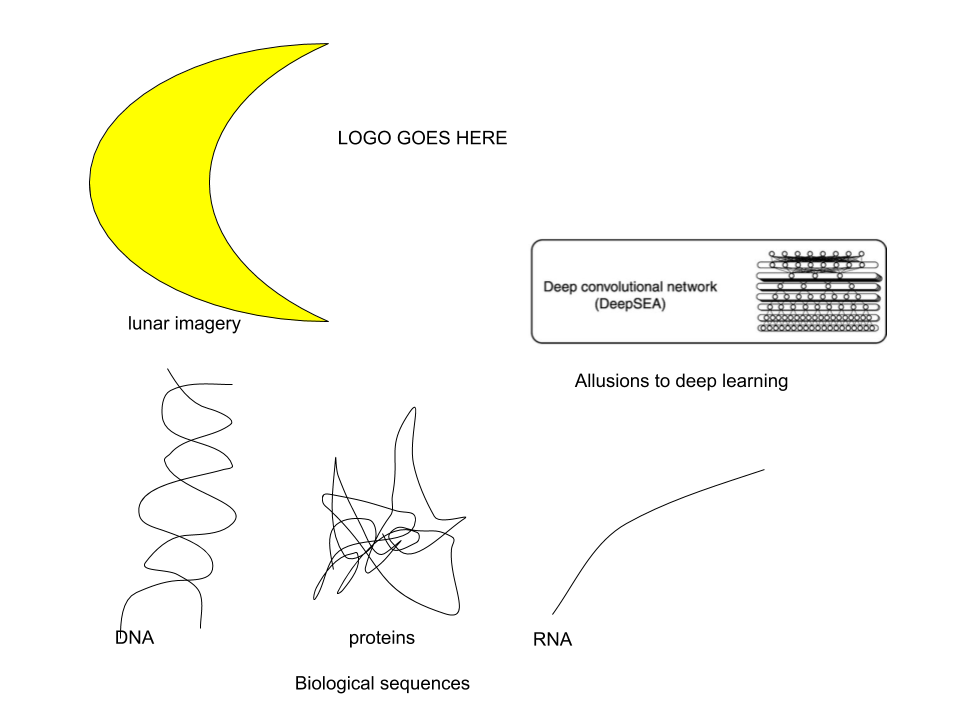

---

You have found Selene, a Python library and command line interface for training deep neural networks from biological sequence data such as genomes.

## Installation

Selene is a Python 3+ package. We recommend using it with Python 3.6 or above. 

### Installing selene with [Anaconda](https://www.anaconda.com/download/) (for Linux):

```sh
conda install -c bioconda selene-sdk
```

### Installing selene with pip:
```sh
pip install selene-sdk
```

### Installing selene from source:

First, download the latest commits from the source repository (or download the latest tagged version of Selene for a stable release):
```
git clone https://github.com/FunctionLab/selene.git
```

The `setup.py` script requires NumPy. Please make sure you have this already installed.

If you plan on working in the `selene` repository directly, we recommend [setting up a conda environment](https://conda.io/docs/user-guide/tasks/manage-environments.html#creating-an-environment-from-an-environment-yml-file) using `selene-cpu.yml` or `selene-gpu.yml` (if CUDA is enabled on your machine) and activating it.

Selene contains some Cython files. You can build these by running
```sh
python setup.py build_ext --inplace
```

Otherwise, if you would like to locally install Selene, you can run
```sh
python setup.py install
```

Please install `docopt` before running the command-line script `selene_cli.py` provided in the repository.

## About Selene

Selene is composed of a command-line interface and an API (the `selene-sdk` Python package). 
Users supply their data, model architecture, and configuration parameters, and Selene runs the user-specified operations (training, evaluation, prediction) for that sequence-based model.

For a more detailed overview of the components in the Selene software development kit (SDK), please consult the page [here](http://selene.flatironinstitute.org/overview/overview.html).


### Tutorials and examples

Tutorials for selene are available [here](https://github.com/FunctionLab/selene/tree/master/tutorials).

### Documentation

The documentation for selene is available [here](https://selene.flatironinstitute.org/).

